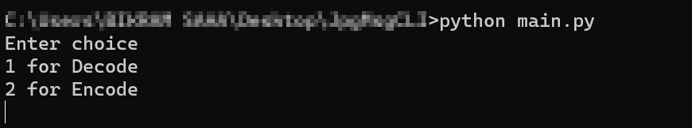

# JpgMsgCli

This project utilises the fact that a jpg file always ends with the hexadecimal byte sequence of `ff d9` and any alteration of the data after that sequence does not affect the image file itself (except increase in the size) hence adding a 'hidden' message after that 'ff d9' does not change how the image file is displayed when viewed using any image viewer.

This program is a simple cli application of the above concept that 'hides' any hidden message inside a jpg file and can also be used to display such 'hidden' message.

## To Run
```
python main.py
```


## Requirements
python (https://www.python.org/downloads/)